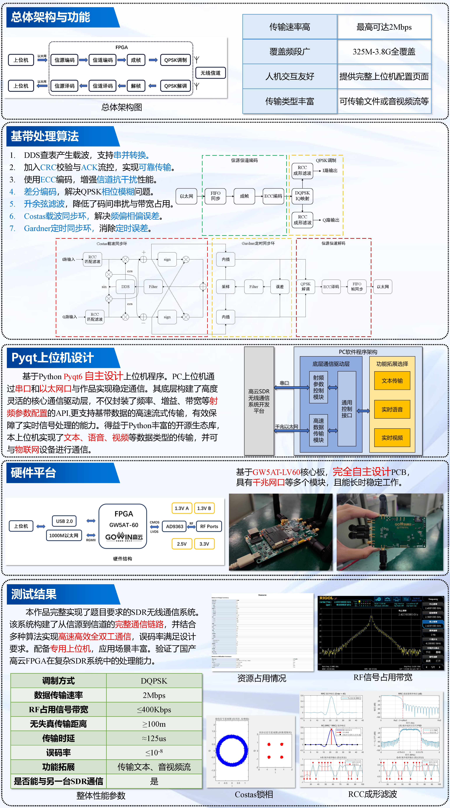
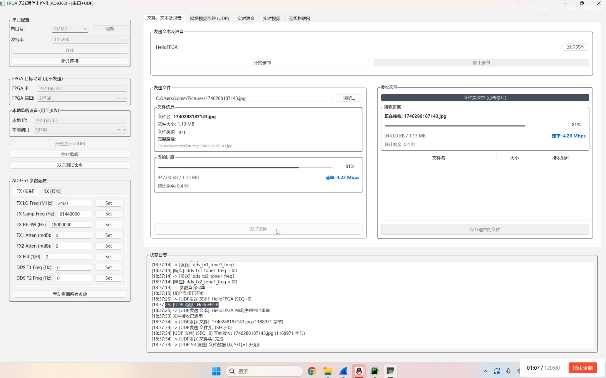
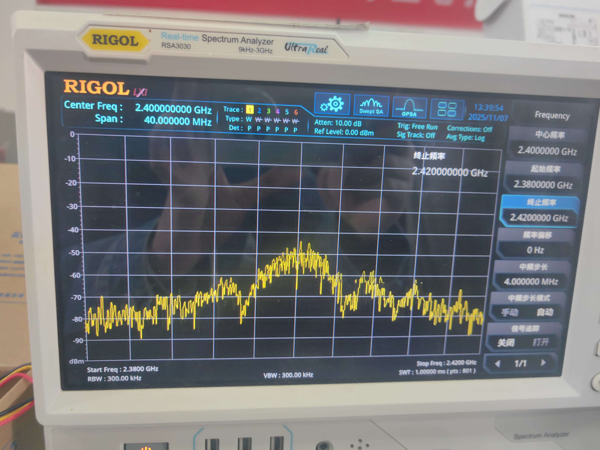
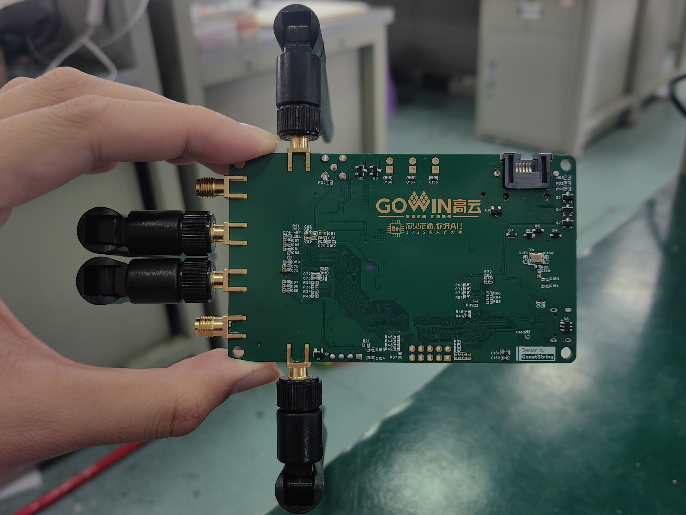

# GoWinSDR

**最后由ConstString于2026-03-10编辑**

**Click to Read English Version：**https://github.com/ConstStrings/GoWinSDR/blob/master/README_EN.MD

## 工程简介

**本项目基于高云 GW5AT-LV60 FPGA与ADI AD9363/AD9361射频收发器，构建了一套灵活可重构的软件无线电（SDR）系统。通过软硬件协同设计，将高速基带处理部署于FPGA，将交互业务部署于Python上位机，通过千兆以太网交互，实现了QPSK等多种实时通信与动态参数配置**

系统可通过千兆以太网或 USB2.0 (开发中)接口连接 PC 端，配套开发的图形用户界面（GUI上位机）能够直观展示通信参数、数据传输状态等信息，支持用户实时配置系统参数、监控传输过程，大幅提升了人机交互体验。经实际测试，该 SDR 无线通信系统可实现两台设备间的真实无线通信，数据传输速率高达 4Mbps

本工程所使用的FPGA只有PL端，因此将AD936X射频芯片的初始化部分代码移植至STM32平台，经测试运行稳定，使用较为方便。除初始化外的所有逻辑均在FPGA上用Verilog实现

相比Xilinx ZYNQ平台上众多的软件无线电开源项目，本项目没有使用异构FPGA，核心逻辑均使用Verilog实现，数据传输路径更加清晰，操作逻辑更加直观和接近底层，便于无线电爱好者/通信工程师/学生等人群更深入的了解软件无线电基本原理，或作为基本平台进行编码等内容的二次开发


## 工程结构

```

GoWinSDR/
├── FPGA/
│   ├── SDR_Final_CMOS/ # 完整版FPGA项目，基于SDR Base底板，实现所有功能
│   ├── SDR_TANG_CMOS/ # AD9363测试项目，基于AD9363_Debug测试板和Sipeed Tang Mega开发板，只能收发单音信号
│   └── Submodule/ # 用于存放测试时使用的子模块，非开发人员请勿使用
├── Firmware/
│   └── GoWinSDR_STM32/ # 初始化AD9363的STM32代码，移植自Xilinx，使用HAL库开发
├── Hardware/
│   ├── Gerber/ # PCB制版文件
│   ├── ProPrj_AD9363_Debug/ # 嘉立创EDA工程，AD9363功能测试板
│   └── ProPrj_GoWinSDR_SMT/ # 嘉立创EDA工程，项目完整PCB
├── Image/  # 存放文档图片
├── Matlab/  # 用于生成滤波器系数
├── Software/ # 基于PyQt的上位机
└── README.MD
```

## 系统框图




## 快速使用

1. **打样工程ProPrj_GoWinSDR_SMT并焊接，测试各部分电源正常**
2. **打开工程GoWinSDR_STM32，通过板载SWD烧录STM32程序**
3. **打开工程SDR_Final_CMOS，将程序下载/固化到FPGA**
4. **使用Pycharm或其他软件运行上位机，检测参数能否配置，能否收发信号**
5. **若发现某一部分工作异常，可以通过串口和高云FPGA内置逻辑分析仪分析错误**


## 核心代码功能介绍
**核心代码位于目录\FPGA\SDR_Final_CMOS\src下**

### 顶层模块
#### `top.v`
> 顶层模块，负责连接各子模块
---
### AD936X 接口
#### `ad9363_dev_cmos.v`
> AD9363 CMOS接口驱动模块。使用IDDR原语从12位并行总线同时采集I/Q两路ADC数据，使用ODDR原语将I/Q两路DAC数据交替输出至发送总线，实现AD9363芯片的收发时序控制。
---
### 以太网
#### `eth_transceiver.v`
> 以太网收发器顶层模块。通过RGMII接口驱动千兆PHY芯片，内部集成125MHz PLL、UDP/IP协议栈，对外提供简洁的用户数据收发接口，支持ARP应答与UDP数据包的封装解析。
#### `eth_frame_gene.v`
> 射频数据帧封装模块（`rf_data_processor`）。将以太网接收到的用户数据加上自定义帧头（`0xEB90CAD3`）和帧尾（`0x55AA5C4B`），通过跨时钟域FIFO送至射频发送侧，用于无线链路的帧同步。
#### `eth_pack.v`
> 射频数据解帧模块（`rf_data_framer`）。从射频解调比特流中搜索帧头，提取有效载荷，通过跨时钟域FIFO送至以太网发送侧，同时支持IQ互换帧头识别与超时帧错误检测。
#### `arp_responder.v`
> ARP响应模块。监听以太网输入数据流，识别ARP请求包并提取发送方MAC/IP，自动构造并回复ARP应答帧，使PC能够正确解析FPGA的MAC地址。
#### `crc.v`
> CRC校验模块，用于以太网帧数据的完整性校验。
---
### 调制解调
#### `qpsk_demod.v`
> QPSK解调顶层模块。集成采样时钟生成、DDS载波生成、混频下变频、低通滤波、Costas环载波同步、Gardner定时同步及差分解码等子模块，完成从中频采样数据到基带比特流的完整解调链路。
#### `costas.v`
> Costas环载波恢复模块。利用片内DDS生成本地载波，对输入I/Q信号进行正交混频，经鉴相器与环路滤波器闭环控制DDS相位，消除接收信号的载波频偏与相偏。
#### `costas_flt_new.v`
> 改进型Costas环路滤波器（`costas_loop_filter_new`）。实现带积分饱和保护的PI（比例-积分）控制器，可配置KP/KI增益参数，将鉴相器误差转换为DDS相位调整量，加快环路锁定速度并提升稳定性。
#### `costas_loop_filter.v`
> Costas环一阶IIR环路滤波器。实现系统函数 `H(z) = c1 + c2·z⁻¹/(1−z⁻¹)` 的差分方程，采用双增益系数组自适应切换策略（前期大系数快速牵引，后期小系数稳定跟踪），输出24位相位控制字。
#### `phase_detector.v`
> QPSK载波同步鉴相器。依据I/Q两路低通滤波后信号的符号位，采用判决引导法计算相位误差：`error = Q·sign(I) − I·sign(Q)`，输出58位有符号相位误差供环路滤波器使用。
#### `gardner_sync.v`
> Gardner定时同步顶层模块。串联内插滤波器、Gardner TED误差检测器与NCO，构成完整的符号定时恢复闭环，输出最佳抽样时刻的I/Q判决数据及同步标志。
#### `gardner_ted.v`
> Gardner定时误差检测器（TED）。利用Gardner算法 `e(k) = I(k−1)·[I(k)−I(k−2)]` 计算符号定时误差，经一阶IIR环路滤波后输出16位误差控制字，同时在最佳判决时刻输出I/Q硬判决数据。
#### `nco.v`
> 数控振荡器（NCO）模块。接收环路滤波器输出的频率控制字`w(n)`，对内部寄存器η递减累加，当η下溢（出现负值）时产生strobe溢出信号，同时输出用于内插滤波器的小数间隔μk，实现符号定时控制。
#### `interpolate_filter.v`
> Farrow结构内插滤波器。依据NCO输出的小数间隔μk，对I/Q输入样值序列进行分段多项式内插（`y(k) = f1·μk² + f2·μk + f3`），在任意相位点重建信号，实现非整数倍采样率转换。
---
### 射频收发
#### `rf_rxt.v`
> 射频收发处理顶层模块。接收侧串联Costas环、Gardner定时同步与差分解码，完成QPSK解调输出比特流；发送侧对输入字节数据进行差分编码与QPSK星座映射，驱动DAC输出I/Q基带信号。
#### `rf_diff_encode.v`
> QPSK差分编码模块（`qpsk_differential_encoder`）。将当前2位输入数据与上一时刻I/Q状态进行异或运算，实现差分相移编码（DQPSK），消除解调端的相位模糊问题。
#### `rf_diff_decode.v`
> QPSK差分解码模块（`qpsk_differential_decoder`）。将当前I/Q判决位与前一符号进行异或，恢复原始2位数据，与差分编码端对应，实现相位模糊的透明消除。
---
### 其他
#### `calibration.v`
> 信号校准模块。对ADC输入数据进行平方运算，经FIR低通滤波提取信号包络，再由正弦波频率计测量当前频率，最终通过`data_sender_24bit`将24位校准频率数据输出至外部（STM32），用于系统标定。
#### `com_fpga.v`
> FPGA与MCU通信模块（`data_sender_24bit`）。将128分频后的低速时钟作为数据时钟，在STM32请求信号触发下，按状态机逐字节串行输出24位数据，实现FPGA向STM32的同步并行数据传输。
#### `led_control.v`
> 433MHz OOK解调模块（`demod_433`）。对ADC输入的I/Q信号计算瞬时功率（I²+Q²），经64次滑动平均滤波后与功率阈值比较，输出OOK解调数据位，可用于LED状态指示或低速遥控信号接收。
---
### 约束文件
#### `SDR_Test.cst`
> 管脚约束文件
#### `timeconstrain.sdc`
> 时序约束文件
#### `SDR_Test.rao`
> 逻辑分析仪配置文件


## ARM端程序使用方法

**核心代码位于目录\Firmware\GoWinSDR_STM32\Hardware下**

主程序已经实现串口命令读取和配置参数，故可以不用修改代码，直接烧录。需要根据实际引脚修改文件`\Firmware\GoWinSDR_STM32\\Hardware\api\softspi.h`内的SPI相关引脚。

如果想进行更加细致的配置，可修改main.c内的初始化结构体 `AD9361_InitParam default_init_param`，参数具体含义已在注释中

初始化时会通过串口打印初始化日志，初始化成功后打印当前状态：

```
采样频率:
  RX: 61440000 Hz (61.44 MSPS)
  TX: 61440000 Hz (61.44 MSPS)
ad9361_rfpll_int_recalc_rate: Parent Rate 80000000 Hz
ad9361_rfpll_int_recalc_rate: Parent Rate 80000000 Hz

LO频率:
  RX: 2400000000 Hz (2.400 GHz)
  TX: 2400000000 Hz (2.400 GHz)
ad9361_set_tx_atten : attenuation 0 mdB tx1=1 tx2=0
Rx gain can be set in MGC mode only
ad9361_rf_port_setup : INPUT_SELECT 0x3

=== Final Status ===
ENSM (0x017): 0x1A (TX_ON=1)
TX Ctrl (0x002): 0x58
PLL Lock (0x247): 0x02 (TX_PLL=1)
```

支持使用的命令如下，使用串口即可配置，想要查看和修改指令逻辑可以查看\Firmware\GoWinSDR_STM32\\Hardware\ad9361\command.c：

```
help?  - Displays all available commands.
register?  - Gets the specified register value.
tx_lo_freq?  - Gets current TX LO frequency [MHz].
tx_lo_freq=  - Sets the TX LO frequency [MHz].
tx_samp_freq?  - Gets current TX sampling frequency [Hz].
tx_samp_freq=  - Sets the TX sampling frequency [Hz].
tx_rf_bandwidth?  - Gets current TX RF bandwidth [Hz].
tx_rf_bandwidth=  - Sets the TX RF bandwidth [Hz].
tx1_attenuation?  - Gets current TX1 attenuation [mdB].
tx1_attenuation=  - Sets the TX1 attenuation [mdB].
tx2_attenuation?  - Gets current TX2 attenuation [mdB].
tx2_attenuation=  - Sets the TX2 attenuation [mdB].
tx_fir_en?  - Gets current TX FIR state.
tx_fir_en=  - Sets the TX FIR state.
rx_lo_freq?  - Gets current RX LO frequency [MHz].
rx_lo_freq=  - Sets the RX LO frequency [MHz].
rx_samp_freq?  - Gets current RX sampling frequency [Hz].
rx_samp_freq=  - Sets the RX sampling frequency [Hz].
rx_rf_bandwidth?  - Gets current RX RF bandwidth [Hz].
rx_rf_bandwidth=  - Sets the RX RF bandwidth [Hz].
rx1_gc_mode?  - Gets current RX1 GC mode.
rx1_gc_mode=  - Sets the RX1 GC mode.
rx2_gc_mode?  - Gets current RX2 GC mode.
rx2_gc_mode=  - Sets the RX2 GC mode.
rx1_rf_gain?  - Gets current RX1 RF gain.
rx1_rf_gain=  - Sets the RX1 RF gain.
rx2_rf_gain?  - Gets current RX2 RF gain.
rx2_rf_gain=  - Sets the RX2 RF gain.
rx_fir_en?  - Gets current RX FIR state.
rx_fir_en=  - Sets the RX FIR state.
dds_tx1_tone1_freq?  - Gets current DDS TX1 Tone 1 frequency [Hz].
dds_tx1_tone1_freq=  - Sets the DDS TX1 Tone 1 frequency [Hz].
dds_tx1_tone2_freq?  - Gets current DDS TX1 Tone 2 frequency [Hz].
dds_tx1_tone2_freq=  - Sets the DDS TX1 Tone 2 frequency [Hz].
dds_tx1_tone1_phase?  - Gets current DDS TX1 Tone 1 phase [degrees].
dds_tx1_tone1_phase=  - Sets the DDS TX1 Tone 1 phase [degrees].
dds_tx1_tone2_phase?  - Gets current DDS TX1 Tone 2 phase [degrees].
dds_tx1_tone2_phase=  - Sets the DDS TX1 Tone 2 phase [degrees].
dds_tx1_tone1_scale?  - Gets current DDS TX1 Tone 1 scale.
dds_tx1_tone1_scale=  - Sets the DDS TX1 Tone 1 scale.
dds_tx1_tone2_scale?  - Gets current DDS TX1 Tone 2 scale.
dds_tx1_tone2_scale=  - Sets the DDS TX1 Tone 2 scale.
dds_tx2_tone1_freq?  - Gets current DDS TX2 Tone 1 frequency [Hz].
dds_tx2_tone1_freq=  - Sets the DDS TX2 Tone 1 frequency [Hz].
dds_tx2_tone2_freq?  - Gets current DDS TX2 Tone 2 frequency [Hz].
dds_tx2_tone2_freq=  - Sets the DDS TX2 Tone 2 frequency [Hz].
dds_tx2_tone1_phase?  - Gets current DDS TX2 Tone 1 phase [degrees].
dds_tx2_tone1_phase=  - Sets the DDS TX2 Tone 1 phase [degrees].
dds_tx2_tone2_phase?  - Gets current DDS TX2 Tone 2 phase [degrees].
dds_tx2_tone2_phase=  - Sets the DDS TX2 Tone 2 phase [degrees].
dds_tx2_tone1_scale?  - Gets current DDS TX2 Tone 1 scale.
dds_tx2_tone1_scale=  - Sets the DDS TX2 Tone 1 scale.
dds_tx2_tone2_scale?  - Gets current DDS TX2 Tone 2 scale.
dds_tx2_tone2_scale=  - Sets the DDS TX2 Tone 2 scale.
calibration?  - Get Lo Freq diff.
calibration=  - Calibrate Lo Freq diff.
rx_lo_up=  - Increase RX LO frequency.
rx_lo_down=  - Decrease RX LO frequency.
query_led_state?  - Decrease RX LO frequency.
query_led_state=  - Decrease RX LO frequency.

```


## 上位机功能介绍

上位机基于 **Python + PyQt6** 开发，采用多线程架构，通过串口与以太网双通道与 FPGA 通信，提供图形化的参数配置、数据收发与实时监控功能。

---

### 启动方法

安装好Python开发环境后，在PyCharm等软件内运行main.py

### 整体架构

主窗口 (`main_window.py`) 采用左右分栏布局：左侧为配置区，右侧为多选项卡功能区。后台运行多个独立的 QThread 工作线程，分别负责串口通信、UDP 网络收发、音频流采集/播放和摄像头采集，所有线程间通过 Qt 信号槽机制进行线程安全的数据传递。

---

### 串口通信

`serial_worker.py` 实现了串口工作线程，支持可用端口枚举、可配置波特率（最高 921600bps）的串口连接/断开，以及全双工的数据收发。接收端对数据流进行逐行解析：格式为 `key=value` 的响应被识别为参数回调并转发至参数面板，其余内容作为日志显示。

`config_widget.py` 提供串口配置 UI，包含端口刷新、波特率选择及连接状态管理。

---

### 以太网通信（UDP）

`ethernet_worker.py` 实现了基于 UDP 的可靠/不可靠双模式传输协议：

- **文本命令**：采用停等协议（Stop-and-Wait），支持最多 128 次重传。
- **文件传输**：先用停等协议发送文件头（含文件名与大小），再用 **SR（Selective Repeat）滑动窗口协议**（窗口大小为 4）发送文件数据，实现乱序重传；全程携带 CRC32 校验。
- **实时视频流**：采用自定义分包协议（帧头含帧ID、分片序号、总分片数），允许丢包，每帧拆分为最大 1024 字节的分片后以不可靠方式发送，接收端按帧ID进行分片重组。
- **实时音频流**：以不可靠方式直接发送 PCM 音频块，保证低延迟实时性。

`ethernet_widget.py` 提供 UDP 配置 UI，含 FPGA 目标地址（IP/端口）和本地监听地址配置，以及开始/停止监听按钮。

---

### AD9363 参数配置

`params_widget.py` 提供 AD9363 射频芯片的参数配置面板，分 TX（发射）和 RX（接收）两个选项卡，涵盖本振频率、采样率、射频带宽、增益控制、FIR 使能及 DDS 音调频率等参数的读取与设置。每个参数条目包含输入框和 Set 按钮，点击后通过串口发送 `key=value` 格式命令。支持"手动查询所有参数"一键刷新，以及在连接后自动批量查询所有 GET 命令（`ad9363_config.py` 中定义）。

---

### 文件、文本及录音

`text_audio_widget.py` 支持通过串口发送文本消息，以及触发音频录制/停止。

`file_send_widget.py` 实现文件发送 UI，包含文件浏览、文件信息预览（文件名、大小、类型、路径），以及带实时进度条、传输速率（Mbps）和预计剩余时间的传输状态显示。

`file_receive_widget.py` 实现文件接收 UI，支持启用/禁用文件接收，显示带进度条和速率的实时接收状态，已接收文件列入表格并可选择保存到本地。

---

### 实时语音传输

`realtime_audio_widget.py` 提供实时双向语音传输界面，发射侧支持枚举系统音频输入设备（包括 WASAPI 内录），选择音源后启动麦克风采集并通过 UDP 实时发送；接收侧将网络接收的 PCM 数据送入音频输出队列实时播放。两侧均内嵌波形图实时显示音频波形。

`audio_stream_worker.py` 基于 sounddevice 库实现：`AudioInputWorker` 以回调方式从指定设备连续采集 44100Hz/单声道/float32 音频块；`AudioOutputWorker` 通过队列缓冲驱动扬声器输出，缓冲不足时静音以减少噪声。

---

### 实时视频传输

`realtime_video_widget.py` 提供实时双向视频界面，发射侧开启本地摄像头并实时预览，同时将视频帧编码为 WebP 格式通过 UDP 发送；接收侧将网络视频帧解码后实时渲染。

`camera_worker.py` 基于 OpenCV 实现摄像头采集，在独立内部线程中以设定的限速循环抓帧，水平翻转后分别发出 QImage（供本地预览）和 WebP 字节流（供网络发送）两路信号。

---

### 网络视频监控

`video_widget.py` 提供独立的 UDP 视频监控选项卡，仅用于接收和显示来自 FPGA/网络的视频流，支持视频标签自动缩放。

---

### 无线物联网控制

`iot_widget.py` 实现一个简单的 IoT 设备状态监控演示页面。启动监控后自动设置 RX 本振频率至 434MHz，并以 500ms 为周期轮询 `query_led_state?` 指令；根据串口返回的状态（"1"/"0"）驱动自绘灯泡控件亮起或熄灭，模拟 433MHz 无线遥控设备的状态可视化。

---

### 波形显示

`waveform_widget.py` 是一个基于 QPainter 和 NumPy 的自定义音频波形控件，采用离屏 Pixmap 双缓冲渲染，支持可调增益放大（默认 5 倍）与幅度裁剪，自适应控件宽度对波形数据进行采样/插值显示。

---


## PCB相关事项

1. 由于包含射频和高速信号，进行PCB打样时**需要进行阻抗管控**！！！，使用嘉立创进行打样，层压选择**JLC06161H-3313**，阻抗管控+/-20%即可
2. 焊接时如果没有把握，**请务必先焊接电源部分，确定电源输出电压正常后再焊接其他部分**，防止烧毁芯片
3. 上电前请**确定各路电源是否对地短路**，即使是SMT也是有可能短路的
4. PCB已经经过多版本迭代，理论上不存在重大问题，请先确定焊接是否到位


## 测试结果

### 文件传输测试



### 频谱情况（早期测试结果）




## 成品展示





## 声明

- 本工程的Costas环与Gardner环部分参考开源工程：https://github.com/lauchinyuan/FPGA_QPSK-modem 非常感谢大佬的开源
- 本工程的以太网收发器部分参考自Sipeed例程：https://github.com/sipeed/TangMega-138K-example，本工程初始验证版也是基于Sipeed出品的TangMega-138K开发板


## 写在最后

**这个工程耗费我个人及我们团队相当大的精力，尽管AD936X是一款资料较多的成熟芯片，但现有项目基本是建立在ZYNQ系列上的，代码耦合程度较高，不方便学习。调试软件和硬件的过程非常痛苦，但好在最后成功将整个系统基本搭建成功，并在2025年的嵌赛FPGA赛道决赛中获得奖项。由于各种各样的主客观原因，一部分设计目标尚未完成，ARP请求未实现需手动添加（截止2026-3-10），QPSK会出现bug（截止2026-3-10）,  Gardner环在高码率会失锁（截止2026-3-10），在繁忙的学业之余，我会尽力去完善这个项目，也希望大家谅解**

如果有任何问题或想要交流，可以通过邮件联系我：
3207235590@qq.com
conststrings@gmail.com
